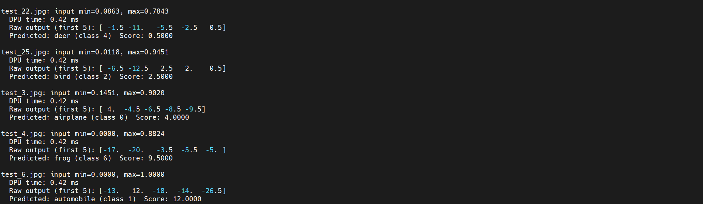

# CIFAR-10 Classification on Vitis AI (AXU2CGB)

This project implements an end‑to‑end Vitis AI flow for CIFAR‑10 image classification, targeting the **AXU2CGB** board with DPU B1152.

## Repository Structure
```
CIFAR10-Vitis-AI-/
├── CIFAR10_DNNDK_lab/
│   ├── train.py                      # CNN training on CIFAR-10
│   ├── freeze.py                     # Convert model to frozen graph (.pb)
│   ├── quantize.py                   # INT8 quantization
│   ├── quantize.sh                   # Quantization pipeline script
│   ├── compile.sh                    # Compile model for DPU B1152
│   ├── lib_compiler.sh               # Generate runtime shared library (.so)
│   ├── run_all.sh                    # Full automated pipeline
│   ├── graph_input_fn.py             # Calibration preprocessing
│   ├── extract_sample.py             # Extract CIFAR samples
│   ├── inspect_graph.py              # Model graph debugging
│   ├── AXU2CGB_DPU_B1152.*           # DPU configuration files
│
├── Deploy/              
│   ├── test.py                      # Inference test script
│   ├── libdpumodelcifar10.so        # Compiled DPU runtime library
│
├── Vitis_AI_env/                    # Docker and environment setup
└── README.md
```
## Requirements

- **Vitis AI** v1.2.4 
- **Target board**: AXU2CGB with DPU B1152 (or similar)
- **Host PC**: Ubuntu 18.04/20.04 with Docker installed
- **CIFAR‑10 dataset** (automatically downloaded by `train.py`)

## 1. Training model
The first step is to train a CNN model using the CIFAR-10 dataset.
```bash
python train.py
```
## 2. Freeze model
Convert checkpoint to frozen graph (.pb)
```bash
python freeze.py
```
## 3. Quantize to INT8
Run quantization using calibration dataset
```bash
./quantize.sh
```
## 4. Compile
Compile model for DPU B1152
```bash
./compile.sh
```
## 5. Generate share library
Create runtime library for FPGA execution
```bash
 ./lib_compiler.sh
```
## 6. Deploy
Run inference on FPGA
```bash
python test.py
```
## 7. Result

The trained CIFAR-10 model was successfully deployed on the AXU2CGB FPGA board using the Vitis AI DPU (B1152). After completing the full pipeline (training, quantization, compilation, and deployment), the model is able to perform real-time image classification on the FPGA.

The inference result below shows the prediction output from the deployed DPU model.


